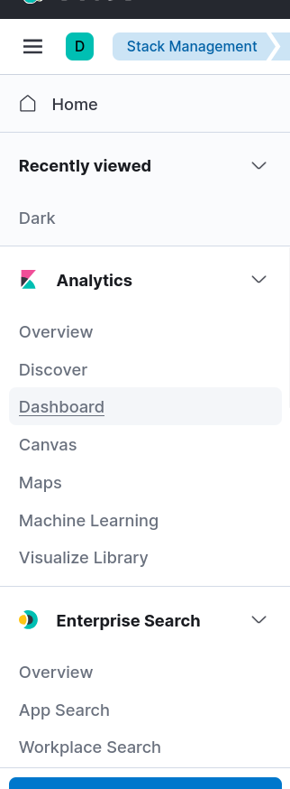
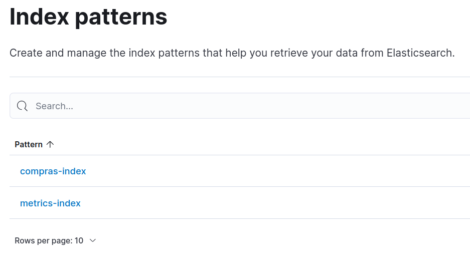
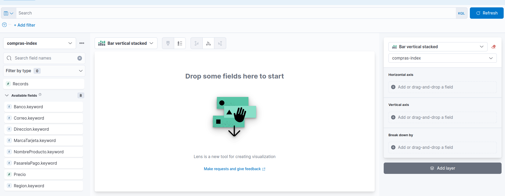
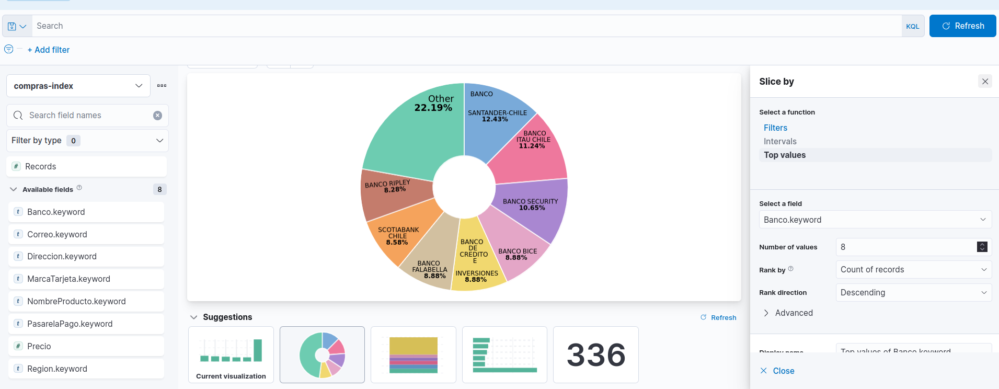
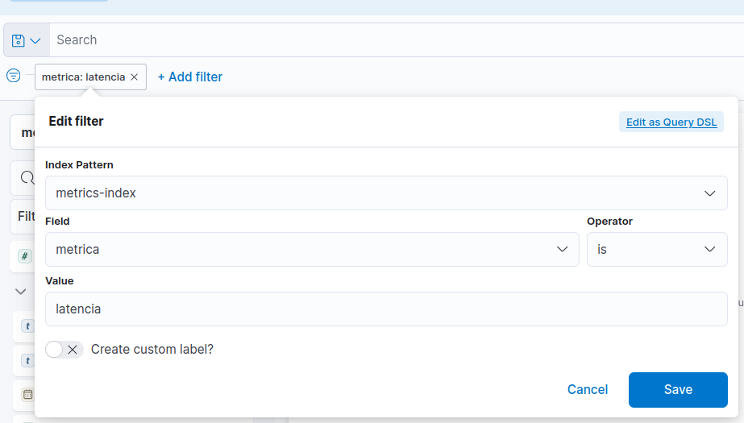
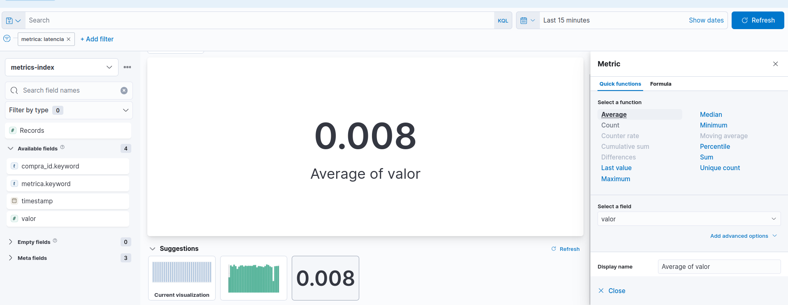

# 🛒 Proyecto: Sistema Distribuido para la Gestión Logística en una Aplicación de Ecommerce

Este proyecto implementa un sistema distribuido no monolítico para gestionar el estado de los pedidos en una aplicación de ecommerce, utilizando Apache Kafka como sistema de mensajería, gRPC para la comunicación interna, y Elasticsearch para el almacenamiento y análisis de métricas de rendimiento.

## 🛠️ Requisitos del Sistema

- 🐋 Docker y Docker Compose
- 🐍 Python 3.8 o superior

## 📦 Instalación de Dependencias

Ejecuta los siguientes comandos para instalar las dependencias necesarias:

```bash
sudo pip install grpcio grpcio-tools confluent-kafka elasticsearch
```

### ⚙️ Configuracion del entorno

1. Clonamos el repositorio y nos dirigimos a la carpeta root del repositorio.

    ```bash
    sudo git clone https://github.com/Juakoooooo/Tarea2_SistemasDistribuidos.git
    cd Tarea2_SistemasDistribuidos
    ```

2. Levantamos los contenedores.

    ```bash
    sudo docker-compose up -d
    ```

3. Si queremos detener los contenedores, recomendamos usar este comando para evitar errores con los volúmenes de kafka

    ```bash
    sudo docker compose down --volumes --rmi all --remove-orphans
    ```

### 🚀 Ejecución del proyecto

Para ejecutar el proyecto, abre tres terminales separadas y sigue los pasos en el orden indicado:

#### 1. Ejecutar el servidor gRPC 🖥️

En la primera terminal, inicia el servidor gRPC:

```bash
cd grpc_server
sudo python3 server.py
```

#### 2. Ejecutar el consumer de kafka 📥

En la segunda terminal, inicia consumer:

```bash
cd consumer
sudo python3 consumer.py
```

#### 3. Ejecutar el cliente gRPC 📤

En la tercera terminal, inicia el cliente gRPC:

```bash
cd grpc_client
sudo python3 client.py
```

El cliente gRPC leerá el archivo **compras_dataset.csv** y enviará las solicitudes de compra al servidor gRPC, que a su vez las transmitirá al productor de Kafka. El consumidor de Kafka procesará los mensajes y los almacenará en Elasticsearch.

## ✉️ Pruebas de la Funcionalidad de Envío de Correos

Por defecto, la funcionalidad de envío de correos está comentada en el archivo **consumer/consumer.py** para evitar el envío masivo de correos durante las pruebas. Si deseas probar esta funcionalidad, ***descomenta*** la sección de código debajo de la linea que dice "*Este apartado de código realiza el procesamiento de los datos y envíos de correos*", quedaria de tal forma:

```python
#Este apartado de código realiza el procesamiento de los datos y envíos de correos
from confluent_kafka import Consumer
from elasticsearch import Elasticsearch
import json
import time
import random
import smtplib
from email.mime.text import MIMEText...
```

Luego, si lo deseas, puedes cambiar el correo de destino, para verificar esta funcionalidad en:

```python
compra_id = msg.key().decode('utf-8')
destinatario = "lexislema10@gmail.com" # email a cambiar
maquina_estados(compra_id, destinatario)
```

Finalmente, El nivel de carga puede ajustarse cambiando la variable carga_trabajo en el archivo **consumer/consumer.py**. La carga puede ser "baja", "media" o "alta", lo que afecta el tiempo de espera entre el procesamiento de mensajes. Modifica la línea:

```python
carga_trabajo = "alta"
```

a "media" o "baja" para simular diferentes condiciones de carga.

## Kibana 📊

Para conectarse a Kibana y visualizar las métricas y datos relacionados con los pedidos, se deben seguir los siguientes pasos:

1. Una vez ejecutado el proyecto, nos dirigimos al localhost, en el puerto 5601.
   [**kibana**](http://localhost:5601/app/home#/)
   

2. Luego nos dirigimos al apartado de **dashboard**
   

3. Nos pedira crear *index pattern*, lo hacemos con los dos index mandados por kafka: **compras-index** y **metrics-index**.
    
    

4. Luego en el dashboard, creamos una visualización:
   

5. Finalmente, para consultar datos respecto a los pedidos podemos elegir algún campo en particular, seleccionar el tipo de gráfico y configuraciones relacionadas con la información que muestra el gráfico
   

Por otro lado, si queremos analizar las métricas como *latencia* o *throughput*, seleccionamos el filtro, determinamos el campo **metrica** y le asignamos el valor que nosotros queramos analizar (en este caso, latencia).
    

Se mostrará lo siguiente (notar que se seleccionó como funcion **Average**):
    

## 📚 Referencias

- [Apache Kafka Documentation](https://kafka.apache.org/documentation/)📜
- [gRPC Documentation](https://grpc.io/docs/)🚀
- [Elasticsearch Documentation](https://www.elastic.co/guide/en/elasticsearch/)🔍
- Código usade de César Muñóz disponible en [consumer.py](https://github.com/cesarmunozr/SD-2024-2/blob/kafka/consumer.py)💻
